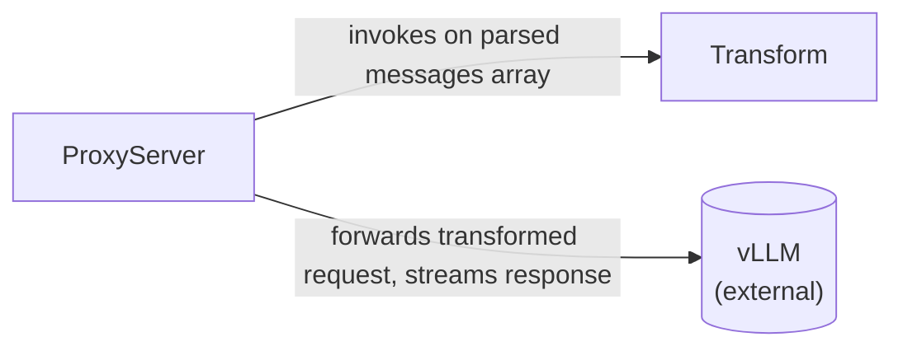

# Component Catalogue — qwaude-proxy (role-coercion-proxy)

## Part A — Machine-Readable Catalogue

```yaml
components:
  - name: Transform
    summary: Rewrites mid-conversation system-role messages so vLLM's tokenizer never sees a system message anywhere but index 0.
    behaviour: >
      Leaves messages[0] untouched if it is role:"system". For every other message with
      role:"system", rewrites role to "user" and prepends a configurable notice prefix to its
      text content. Handles both plain-string content and content-block-array content (only the
      first text block is prefixed in the array case). Preserves every other field on the message
      and on the request untouched — tool_calls, tool_call_id, name, cache-control hints, and any
      unknown fields round-trip byte-identical. Pure function: no I/O, no network, no shared
      mutable state. Reports, for logging purposes, how many messages were coerced and their
      original indices. Zero-copy/low-allocation wherever serde's ownership model allows it; any
      unavoidable allocation is documented at the code-generation level with its actual cost.
    responsibilities:
      - Message role coercion (system -> user, except index 0)
      - Content-shape-aware notice prefixing (string vs content-block-array)
      - Unknown-field and unrelated-field round-tripping
      - Coercion count/index reporting for structured logging
    depends_on: []
    dependents:
      - component: ProxyServer
        interaction: ProxyServer invokes Transform synchronously on the parsed messages array before forwarding the request upstream
    external_dependencies: []
    entities:
      - name: ChatCompletionRequest
        identifier: n/a — value object, recreated fresh per request, never persisted
        attributes: [messages, model, stream, "...other OpenAI-schema fields (passed through, not inspected)"]
        references:
          - entity: Message
            owned_by: Transform
            relationship: "a ChatCompletionRequest has zero or more Messages, in order, in its messages array"
      - name: Message
        identifier: n/a — value object; its position in the messages array is positional, not an identity
        attributes: [role, content, name, tool_calls, tool_call_id, cache_control, "...unknown fields (round-tripped)"]
        references:
          - entity: ContentBlock
            owned_by: Transform
            relationship: "a Message's content is either a string or an ordered array of ContentBlocks"
      - name: ContentBlock
        identifier: n/a — value object
        attributes: [type, text, "...other block fields (round-tripped)"]
        references: []

  - name: ProxyServer
    summary: OpenAI-compatible HTTP server that receives chat-completion requests, invokes Transform, and forwards to vLLM.
    behaviour: >
      Listens on a configurable address and exposes POST /v1/chat/completions. Loads
      configuration from environment variables (LISTEN_ADDR, VLLM_BASE_URL, NOTICE_PREFIX,
      LOG_LEVEL) with documented defaults. Validates only that the request body is valid JSON
      with a messages array shaped as expected — no other top-level field (model, temperature,
      etc.) is validated; whatever is or isn't present there passes through untouched. Invokes
      Transform on the parsed messages array, then forwards the (possibly rewritten) request to
      VLLM_BASE_URL, passing the inbound request's Authorization header through unchanged with no
      separately configured upstream credential and no validation of its presence. Streams SSE
      responses through without buffering the full body, preserving backpressure; passes
      non-streaming responses through verbatim (status code, relevant headers, body). Logs
      per-request coercion counts/indices at debug and upstream errors at error, with no payload
      content logged by default. Drains in-flight requests, including long-lived streaming ones,
      on SIGINT/SIGTERM before exiting. Never panics or unwraps on the request path; malformed
      input, unexpected schema shapes, and upstream failures return 400/502/504 with a small JSON
      error body.
    responsibilities:
      - HTTP routing and request/response lifecycle
      - Configuration loading (environment variables, documented defaults)
      - Upstream request forwarding (including auth header pass-through)
      - Streaming (SSE) pass-through and non-streaming pass-through
      - Structured logging (tracing)
      - Graceful shutdown
      - Error-to-HTTP-response mapping (400/502/504 + JSON error body)
    depends_on:
      - component: Transform
        interaction: Invokes the transform on the parsed messages array before forwarding upstream
        style: sync
    dependents: []
    external_dependencies:
      - name: vLLM
        kind: third-party-api
        purpose: Upstream inference server this proxy forwards (transformed) requests to and streams responses from, at the configured VLLM_BASE_URL
    entities:
      - name: ProxyConfig
        identifier: n/a — a single process-wide instance, not per-request
        attributes: [listen_addr, vllm_base_url, notice_prefix, log_level]
        references: []
```

## Part B — Human-Readable View

### Component Diagram



### Component Summary

| Component | Purpose | Depends On | Dependents | Entities Owned |
|---|---|---|---|---|
| Transform | Rewrites mid-conversation system-role messages before they reach vLLM's tokenizer | — | ProxyServer | ChatCompletionRequest, Message, ContentBlock |
| ProxyServer | OpenAI-compatible HTTP server: routes, configures, forwards, streams, logs, shuts down gracefully | Transform | — | ProxyConfig |

### Entity Ownership

| Entity | Owning Component | Identifier | Attributes | References |
|---|---|---|---|---|
| ChatCompletionRequest | Transform | n/a (value object, transient per-request) | messages, model, stream, ...passthrough fields | Message (via `messages`) |
| Message | Transform | n/a (value object; array position, not identity) | role, content, name, tool_calls, tool_call_id, cache_control, ...unknown fields | ContentBlock (when content is an array) |
| ContentBlock | Transform | n/a (value object) | type, text, ...other block fields | — |
| ProxyConfig | ProxyServer | n/a (process-wide singleton) | listen_addr, vllm_base_url, notice_prefix, log_level | — |

### External Dependencies

| Component | Dependency | Kind | Purpose |
|---|---|---|---|
| ProxyServer | vLLM | third-party-api | Upstream inference server this proxy forwards transformed requests to and streams responses from |

### Rationale

| Component | Why a separate building block |
|---|---|
| Transform | Distinct concern (pure message transformation, no I/O) and distinct testability need — the team's affirmed practices require it be independently unit- and property-testable without a server, isolated in its own file. It also carries the highest design risk (serde's ownership model / zero-copy constraints), warranting its own boundary regardless of size. |
| ProxyServer | Owns every I/O and lifecycle concern (HTTP, config, upstream forwarding, streaming, logging, graceful shutdown) as one cohesive unit — these responsibilities change together (a routing change routinely touches config, error handling, or logging in the same commit) and splitting them further would create a component whose only job is forwarding to another component, a named architectural red flag (a "pass-through" component). |

**Alternatives Rejected** (from the Domain Design interview, Q1): a three-component split (`Transform`, `RequestRouter`, `UpstreamClient`) was considered and rejected. `RequestRouter` would have owned inbound HTTP handling with essentially nothing to do except hand off to `UpstreamClient` — the same thin-pass-through anti-pattern the two-component design avoids for `ProxyServer` itself. It would also have required a third source file beyond the team's already-affirmed `transform.rs`/`main.rs` layout. See `decisions.md` ADR-001.

### Support Perspectives

- **Platform (AWS) perspective**: No infrastructure, deployment, or AWS services are in scope for this workflow (confirmed twice in Ideation, and Infrastructure Design is a skipped stage in this workflow's plan). `ProxyServer`'s only external dependency, vLLM, is reached by a plain configured URL (`VLLM_BASE_URL`) — not an AWS-managed resource — so no VPC, IAM, or cost design applies here. If this proxy is deployed to AWS in a future workflow, that topology decision belongs to Infrastructure Design at that time.
- **Design (UX) perspective**: No user interface is in scope — this is a server-only proxy consumed by another program (Bifrost), not a human. The one design-relevant surface is the JSON error body `ProxyServer` returns on failure: it should have a stable, minimal, consistently-shaped structure (status code plus a `message`/`error` field) so Bifrost's own error handling can parse it reliably across all failure modes (malformed input, upstream connection failure, upstream timeout) rather than each error path inventing its own shape.

## Review

**Verdict:** READY
**Reviewer:** aidlc-architecture-reviewer-agent
**Date:** 2026-09-05T12:44:40Z
**Iteration:** 1

### Findings

| ID | Severity | Location | Finding | Required action | Status |
|---|---|---|---|---|---|
| R-01 | Major | components.md > `Transform` component (`behaviour`, `depends_on`/`dependents` interaction text) | `team-practices.md`'s Mandated/Code Style section requires a per-layer typed error convention, naming `TransformError` explicitly as a type "owned by `transform.rs`, describing only transform-time failures" — which presupposes `Transform` has failure modes. But `Transform`'s `behaviour` in this catalogue describes only success paths ("Pure function: no I/O... Handles both plain-string content and content-block-array content") and never states what, if anything, causes `Transform` to fail (e.g. a `content` value that is neither a string nor a content-block array), nor whether such cases are pre-filtered by `ProxyServer`'s stated "messages array shaped as expected" validation before `Transform` is ever invoked. The `ProxyServer -> Transform` interaction edge is documented only as a successful synchronous call ("invokes Transform... before forwarding"), with no failure/error return path named. A developer cannot tell from this artifact alone whether `Transform` returns `Result<_, TransformError>` at all, or what shape of input would produce that error, despite `TransformError` being a Mandated project convention this same stage should have reconciled against the component's actual behaviour. | Add an explicit statement (in `Transform`'s `behaviour` and in the `ProxyServer -> Transform` interaction) of whether/when `Transform` can fail, what constitutes malformed input at that boundary vs. what `ProxyServer`'s own validation already excludes, and how the failure crosses the component boundary — or record it as an open question for Functional/Code-Generation to resolve, rather than leaving it implicit. | New |
| R-02 | Minor | components.md > Support Perspectives (Design/UX) vs. Part A entities | The Design/UX perspective explicitly recommends the JSON error body have "a stable, minimal, consistently-shaped structure (status code plus a `message`/`error` field)" — a data shape the artifact itself flags as design-relevant — but no such entity (e.g. `ErrorResponse`) is captured under `ProxyServer`'s `entities:` in Part A. The machine-readable catalogue is silent on a shape the human-readable narrative treats as worth stabilizing. | Either add the error-body shape as an entity owned by `ProxyServer` (even at ownership+shape depth, per this stage's own capture-depth rule) or note explicitly that it is deferred to Functional Design/Code Generation. | New |
| R-03 | Minor | traceability.json > `coverage[].status` for FR12/FR13 | The stage definition's own example schema for `coverage[]` shows only `"OK"` and `"GAP"` as status values. This artifact introduces a third value, `"N/A"`, for FR12 (lint/format tooling) and FR13 (README) on the reasonable grounds that neither maps to a component — but this is an undocumented extension of the stage's coverage vocabulary. If the `traceability` sensor (declared in this stage's frontmatter) treats any non-`"OK"` status as an uncovered gap, these two rows could be mis-flagged even though the underlying reasoning is sound. | Confirm the `traceability` sensor accepts `"N/A"` as a non-gap status, or fold FR12/FR13 into a `"OK"`-with-note convention (e.g. target: "N/A — tooling, not a component") that the sensor is known to tolerate. | New |
| R-04 | Minor | components.md > Part A entities (`identifier: n/a — value object...`) | All four entities record `identifier:` as an explanatory sentence rather than a real attribute name, per the deliberate Value-Object modeling choice in ADR-002. This is well-reasoned and documented (ADR-002's Alternatives Rejected explicitly considered and rejected a synthetic identifier), so it is not a defect — but the stage's YAML schema comment (`identifier: <attribute that uniquely identifies it>`) implies a field name, not prose, and any downstream tooling parsing this field programmatically (rather than a human reading it) may not expect a full sentence there. | No action required if this catalogue is only ever read by humans/agents; if any tool parses `identifier:` structurally, confirm it tolerates a non-attribute-name value. | New |

### Validation Tool Results

No validation tools are declared in this stage's frontmatter (`domain-design.md` lists no `validation_tools` field); none were run. Well-formedness was checked manually against the stage's rules: component names unique (`Transform`, `ProxyServer`); `depends_on`/`dependents` symmetric (`ProxyServer.depends_on: [Transform]` ↔ `Transform.dependents: [ProxyServer]`); no self-dependency; the dependency graph is a single directed edge (`ProxyServer -> Transform`), acyclic; every entity (`ChatCompletionRequest`, `Message`, `ContentBlock`, `ProxyConfig`) is owned by exactly one component and every `references.entity`/`owned_by` pair resolves to a declared entity/component; the sole `external_dependencies` entry (`vLLM`, kind `third-party-api`) is correctly modeled as a dependency, not a component.

### Summary

The catalogue is structurally sound — no broken references, no cycles, symmetric dependency edges, and every entity singly owned — and the two-component decomposition is well-justified against the team's affirmed file layout and the pass-through anti-pattern, with all four ADRs carrying complete Context/Decision/Consequences/Alternatives Rejected sections. The one point worth the human's attention (R-01) is that the Mandated `TransformError` convention from `team-practices.md` implies `Transform` has failure modes this artifact never names or bounds against `ProxyServer`'s own validation — a gap a developer would have to guess at when implementing the component boundary. The remaining findings are minor documentation/schema-fit notes, not structural defects.
